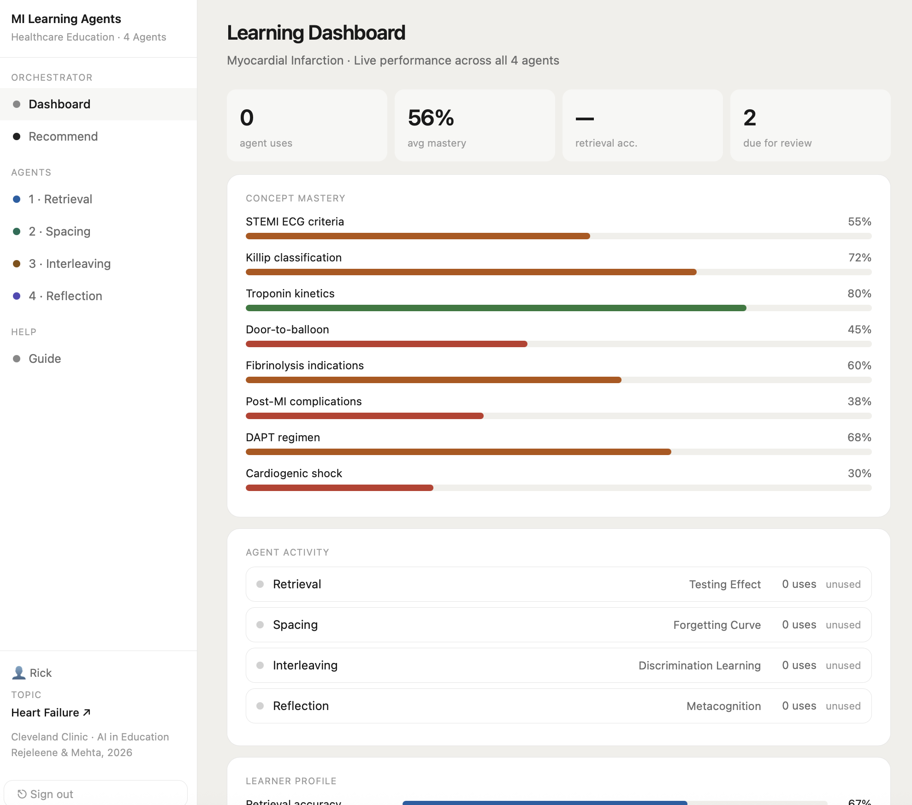
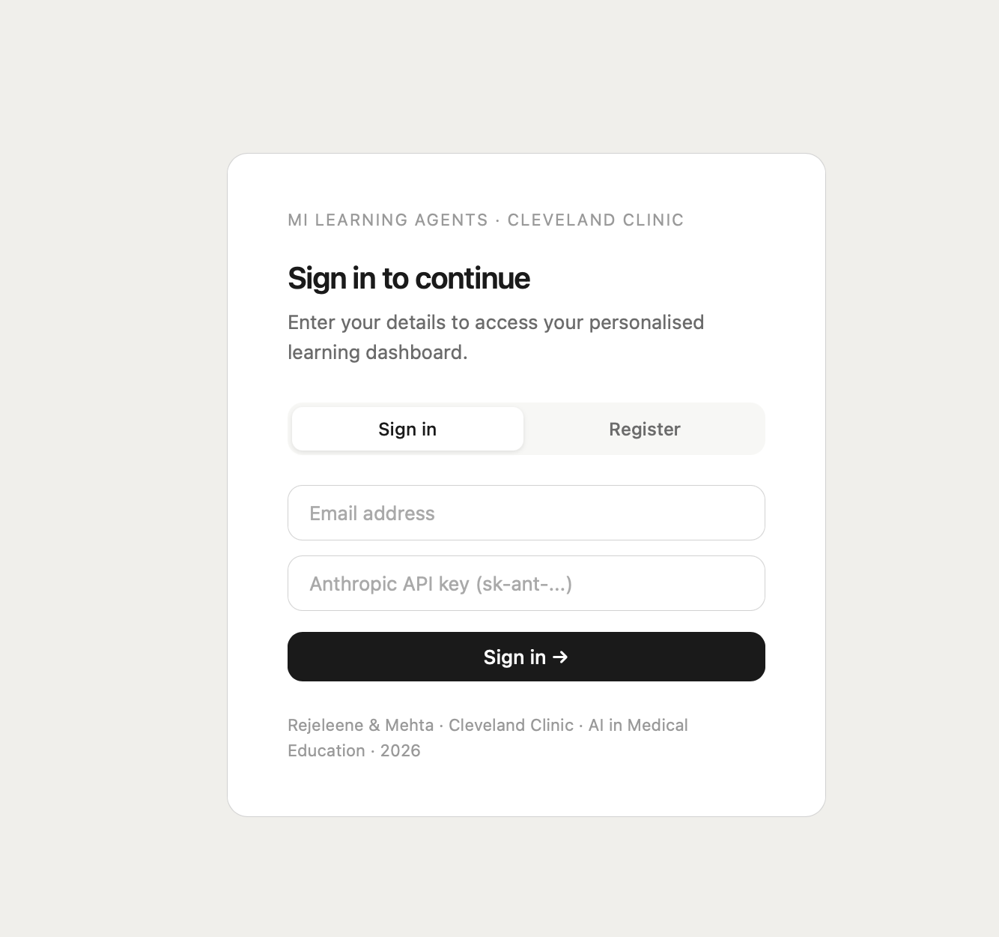

# MI Learning Agents

**Theory-Grounded AI Healthcare Education System**  
Rejeleene & Mehta · Cleveland Clinic · AI in Medical Education · 2026

A multi-agent AI learning system built on validated cognitive science mechanisms — testing effect, spaced repetition, interleaved practice, and metacognitive reflection. Each agent is powered by Claude (Anthropic) and generates questions dynamically based on the learner's selected clinical topic.

---

## Screenshots

### Learning Dashboard & Agent Recommendations


### Login


---

## Features

- **4 AI Agents** — each grounded in a specific learning science theory
- **Dynamic topic switching** — change clinical topic and all agents adapt instantly
- **Spaced repetition** — SM-2 algorithm schedules each concept at the optimal forgetting-curve moment
- **Daily email reports** — 8:00 AM ET, showing accuracy, missed questions, weak concepts, and review links
- **Learner profiles** — per-learner performance tracking, answer history, concept mastery
- **Research export** — password-protected JSON export of all learner data for IRB studies

---

## The 4 Agents

| Agent | Theory | What it does |
|---|---|---|
| **Retrieval** | Testing Effect (Roediger & Karpicke 2006) | Generates MCQs; forces recall before feedback; flags weak concepts for spacing |
| **Spacing** | Forgetting Curve / SM-2 (Ebbinghaus 1885, Wozniak 1987) | Surfaces due concepts at the optimal retention point; SM-2 scheduling |
| **Interleaving** | Discrimination Learning (Kornell & Bjork 2008) | Mixes domains randomly; learner identifies domain before answering |
| **Reflection** | Metacognition (Schön 1983, Flavell 1979) | Generates personalised prompts from actual error history; Socratic follow-up |

---

## How to Use

### For Learners

1. **Open the app** at your deployment URL
2. **Register** with your name, email, and Anthropic API key — or **Sign in** if already registered
3. **Go to Recommend** (under Orchestrator in the sidebar) — the orchestrator ranks all 4 agents by your current learning need
4. **Select a topic** from the preset list or type a custom clinical topic — all agents switch immediately
5. **Use the top-ranked agent** for 10–15 minutes per session
6. **Check your email at 8:00 AM ET** — daily report shows accuracy, questions you got wrong, weak concepts, and direct links to retake or review

### Agent guides

**Retrieval agent**
- Answer each MCQ without notes
- Select A / B / C / D or write a free-text answer
- Claude assesses your answer, explains the correct reasoning, and flags gaps
- Do not skip ahead — the struggle before seeing the answer is the learning mechanism

**Spacing agent**
- Claude checks which concepts are due on your SM-2 schedule
- Write everything you can recall before rating
- Rate your recall honestly: Forgot / Partial / Good / Perfect
- Your rating sets the next review interval — overrating delays the next review too far

**Interleaving agent**
- Questions come from 4 domains in random order: Pathophysiology, Pharmacology, Diagnosis, Clinical Management
- Identify the domain before answering — this is the core exercise
- Domain is revealed after you submit

**Reflection agent**
- Choose a framework: Calibration, Error analysis, Connection, Transfer, or Goals
- Claude generates a prompt grounded in your actual performance history
- Write a reflection, then answer the Socratic follow-up
- Entries are saved to your reflection journal

---

## Setup & Deployment

### Prerequisites

- Node.js 18+
- PostgreSQL database (Railway, Supabase, or local)
- Anthropic API key (each learner provides their own)
- Resend account for email (free tier: 100 emails/day)

### Environment variables

Set these in Railway (or your `.env` file for local development):

```
DATABASE_URL=postgresql://...
ANTHROPIC_API_KEY=sk-ant-...        # server key for orchestrator
ENCRYPTION_KEY=your-secret-key      # AES key for encrypting learner API keys
RESEND_API_KEY=re_...               # from resend.com
FROM_EMAIL=onboarding@resend.dev    # verified sender address
BASE_URL=https://your-app.railway.app
RESEARCH_PASSWORD=research2026      # for /api/research/export
```

### Local development

```bash
git clone https://github.com/ludwigwittgenstein2/mi-learning-agents.git
cd mi-learning-agents
npm install
cp .env.example .env   # fill in your values
npm start
```

App runs at `http://localhost:3000`

### Deploy to Railway

1. Connect your GitHub repo to Railway
2. Add a PostgreSQL plugin
3. Set all environment variables in the Variables tab
4. Railway deploys automatically on every `git push`

---

## API Reference

### Learner endpoints

```
POST /api/learner              Register new learner
POST /api/learner/login        Sign in (requires email + API key)
GET  /api/learner/:id          Get profile, stats, concepts
PATCH /api/learner/:id/topic   Update active topic
GET  /api/learner/:id/concepts Concept schedule
GET  /api/learner/:id/history  Answer history (last 20)
```

### Agent endpoints

```
POST /api/agent/retrieval       Retrieval agent (agentic loop)
POST /api/agent/spacing         Spacing agent
POST /api/agent/interleaving    Interleaving agent
POST /api/agent/reflection      Reflection agent
POST /api/agent/orchestrator    Orchestrator ranking
```

All agent endpoints require: `{ learnerId, message, topic }`

### Research export

```
GET /api/research/export?password=research2026
```

Returns all answer records across all learners as JSON. Each record contains: `learner_id`, `agent`, `topic`, `question`, `answer`, `score` (0–100), `correct` (boolean), `gaps` (array), `feedback`, `created_at`.

---

## Architecture

```
Frontend (index.html)
  └── Vanilla JS — login, topic selector, 4 agent panels, dashboard

Backend (server.js / Express)
  ├── Auth routes — register, login, profile
  ├── Agent routes — agentic loop via Anthropic SDK
  ├── Spacing routes — concept schedule, SM-2
  └── Cron job — daily 8:00 AM ET email reports

Database (PostgreSQL)
  ├── learners — profile, encrypted API key, topic
  ├── concepts — SM-2 schedule per learner
  ├── answers  — full answer history with gaps
  ├── sessions — agent session log
  └── reminders — email log

Email (Resend HTTP API)
  ├── Welcome email — on registration
  └── Daily report — accuracy, wrong questions, weak concepts, review links
```

### Agentic tool loop

Each agent runs up to 6 iterations:
1. `get_learner_history` — personalise to prior errors
2. `get_learner_stats` — calibrate difficulty
3. Generate question / prompt
4. `save_answer` — log interaction with score and gaps
5. `flag_weak_concept` — schedule immediate review for critical gaps
6. `schedule_review` — SM-2 update for the concept just tested.

**Theoretical basis:** the system tests the hypothesis that structured multi-agent learning (testing effect + spacing + interleaving + metacognition) produces more durable retention than unstructured LLM conversation, even when the underlying model is identical.

---

## Citation

```
Rejeleene R, Mehta N. MI Learning Agents: A Theory-Grounded Multi-Agent AI System 
for Healthcare Education. Cleveland Clinic, 2026.
```

---

## License

MIT License — see LICENSE file.

Built with [Anthropic Claude](https://anthropic.com) · [Railway](https://railway.app) · [Resend](https://resend.com)